# Curious Cart — Django E-Commerce Application

## Project Overview

Curious Cart is a Django-based e-commerce web application that provides a complete online shopping experience with customer authentication, product browsing, cart management, wishlist, reviews, order tracking, payments, and an administrative dashboard.

## Technologies

- Python
- Django
- HTML
- CSS
- JavaScript
- Bootstrap
- SQLite
- UPI QR Payment

## Key Features

- Customer registration and login
- Product search and categories
- Wishlist management
- Shopping cart
- Coupon management
- Product reviews
- Order tracking
- Cash on Delivery
- UPI QR payment
- PDF invoice generation
- Password reset with email verification
- Admin dashboard for managing products, customers, orders, and feedback

# Screenshots

### Customer Home Page

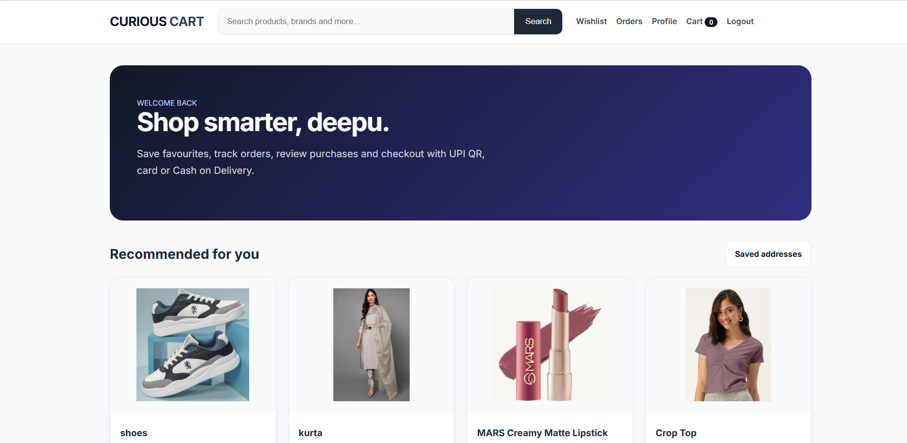

### Product Page

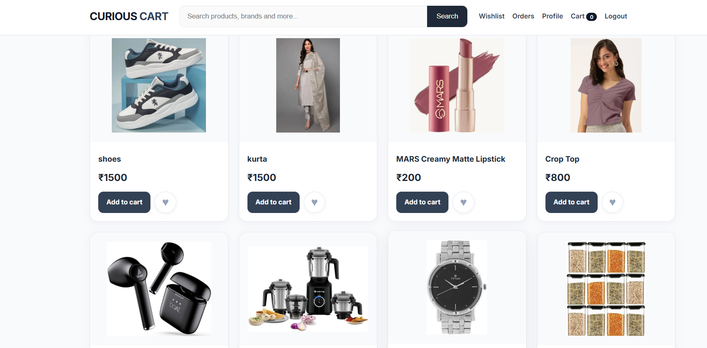

### Wishlist

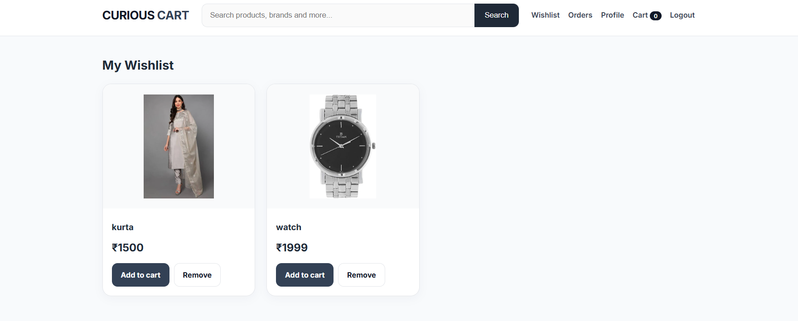

### Shopping Cart

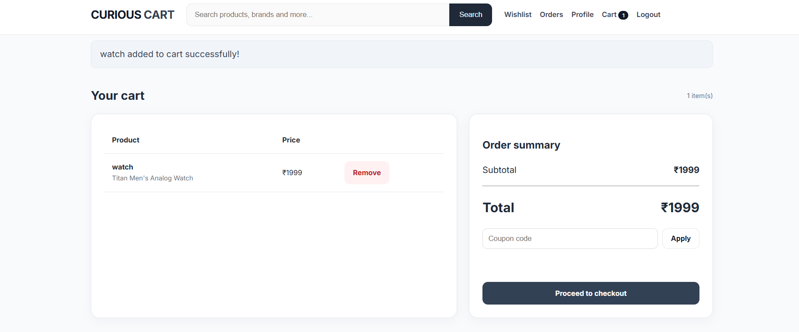

### Payment — UPI QR / Cash on Delivery

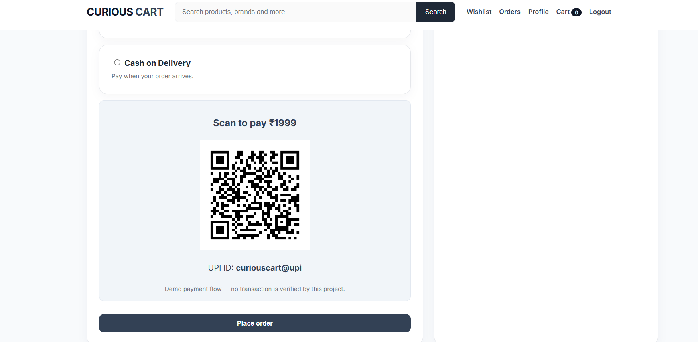

### Order Tracking

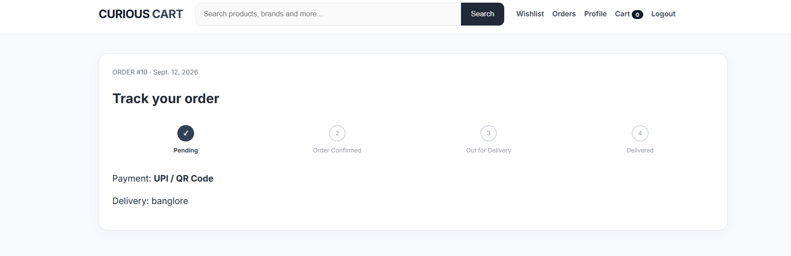

### Customer Profile

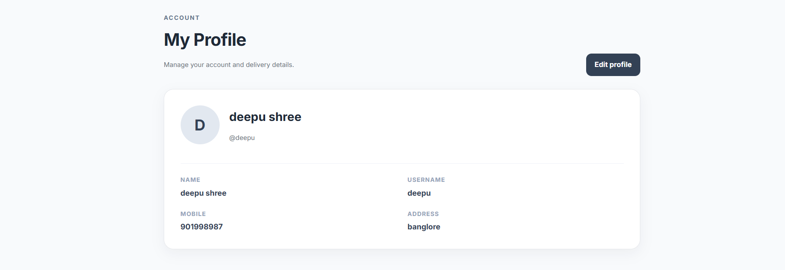

### Admin Dashboard

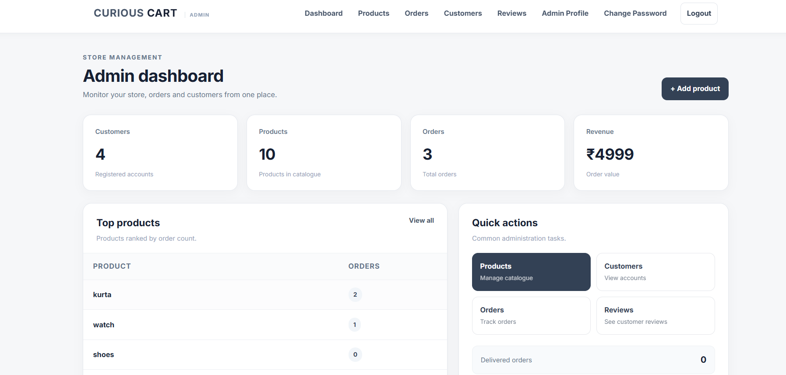

### Product Management

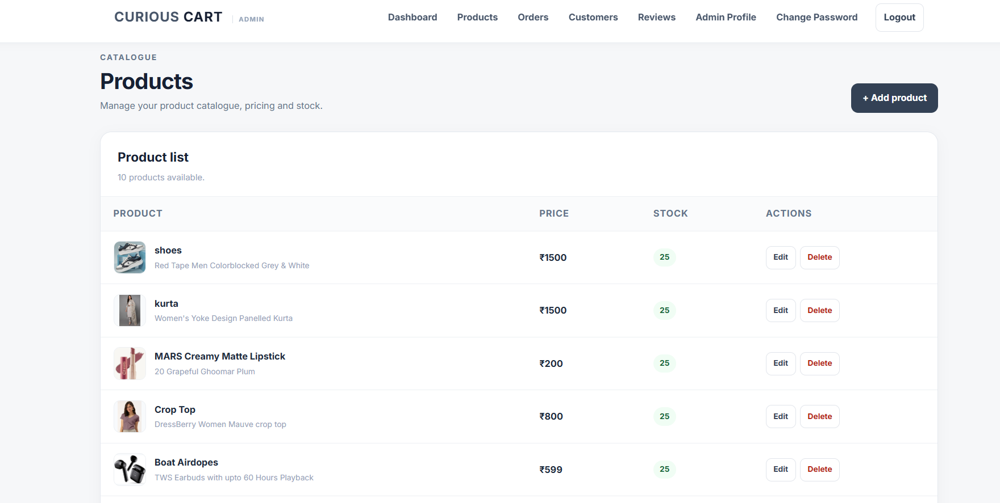

### Customer Management

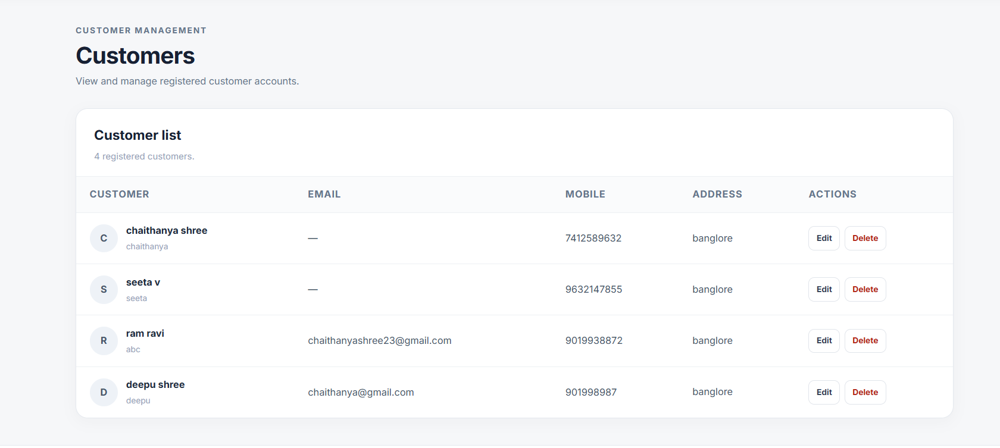

### Order Management

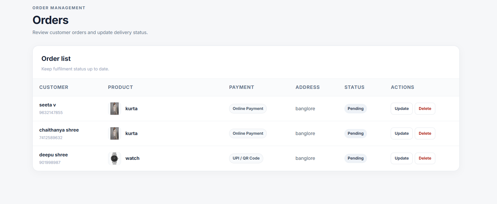

## How to Run

```bash
python -m venv venv
# Curious Cart — Professional Ready

A Django e-commerce portfolio application with a balanced customer/admin theme.

## Included
- Customer sign-up and sign-in using username or registered email
- Forgot password with 6-digit email verification code (10-minute expiry)
- Wishlist, reviews, search, categories and sorting
- Cart, coupons, saved addresses and order tracking
- Online payment demo with UPI QR and Cash on Delivery
- PDF invoice
- Professional admin dashboard for products, customers, orders and feedback
- SQLite database with the included existing project data

## Run on Windows
```powershell
python -m venv venv
Set-ExecutionPolicy -Scope Process -ExecutionPolicy RemoteSigned
.\venv\Scripts\Activate.ps1
pip install -r requirements.txt
python manage.py migrate
python manage.py runserver
```
Open http://127.0.0.1:8000/

## Email password reset
Password reset needs an SMTP sender. For Gmail, enable 2-Step Verification and create a Google App Password. Set these environment variables before starting the server:

```powershell
$env:EMAIL_HOST_USER="yourgmail@gmail.com"
$env:EMAIL_HOST_PASSWORD="your-16-character-app-password"
$env:DEFAULT_FROM_EMAIL="yourgmail@gmail.com"
```

Then run `python manage.py runserver`. Customer accounts must have a valid registered email. Existing accounts with an empty email can be updated from the Admin → Customers → Edit screen.

## Important
Do not delete `db.sqlite3` if you want to keep the included customer/product/order data.


GMAIL PASSWORD RESET SETUP
--------------------------
1. Copy .env.example to .env in the same folder as manage.py.
2. Create a Google App Password for the Gmail account that will send Curious Cart emails. Do NOT use your normal Gmail password.
3. Put these values in .env:
   EMAIL_HOST_USER=yourgmail@gmail.com
   EMAIL_HOST_PASSWORD=your-16-character-app-password
   DEFAULT_FROM_EMAIL=yourgmail@gmail.com
4. Save .env and restart the Django server.
5. The customer account must have that customer's own email saved. Existing old accounts with a blank email must be updated by the administrator once.

If Gmail settings are not configured, the project uses Django's local console email backend so the application itself still starts. Real Gmail delivery requires valid Gmail/App Password settings.
